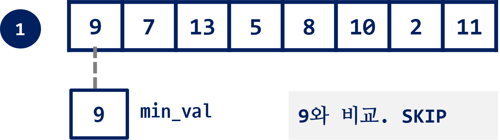
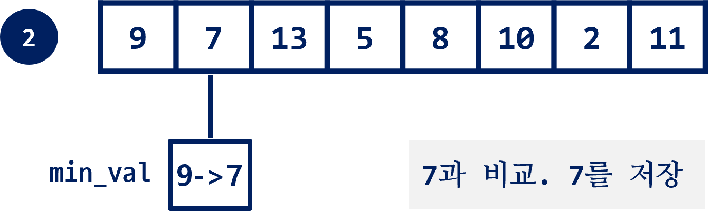
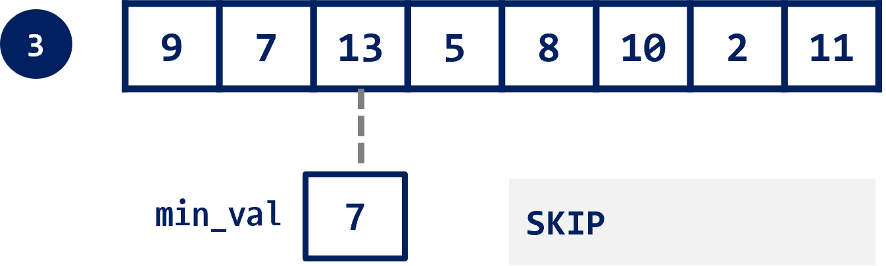
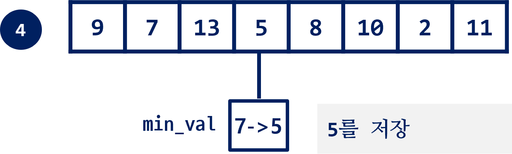
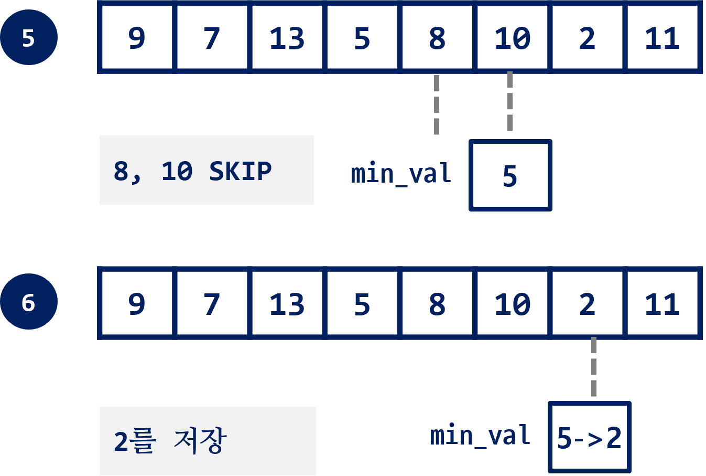
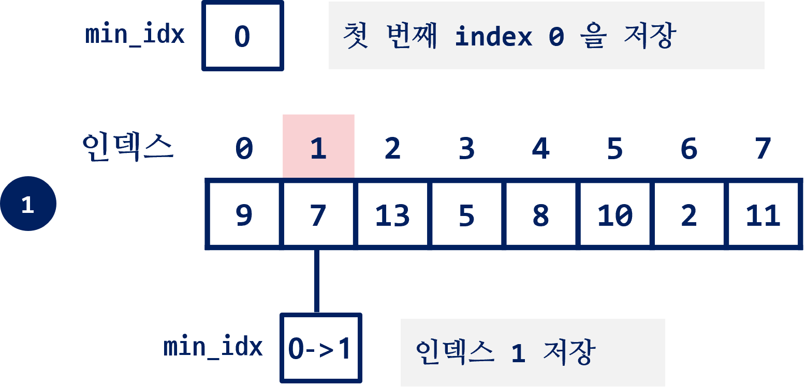
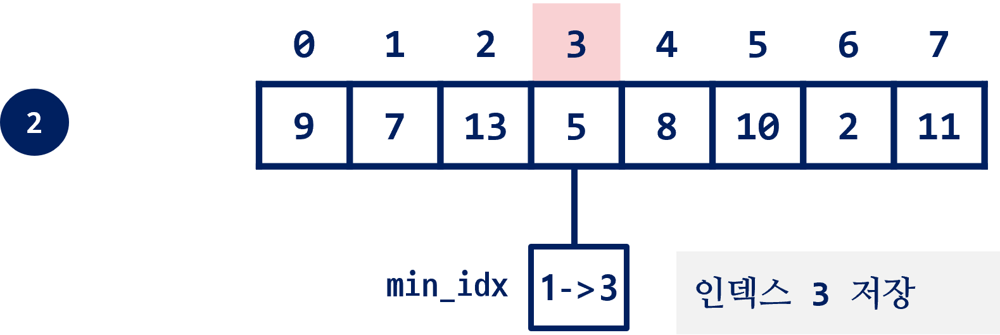
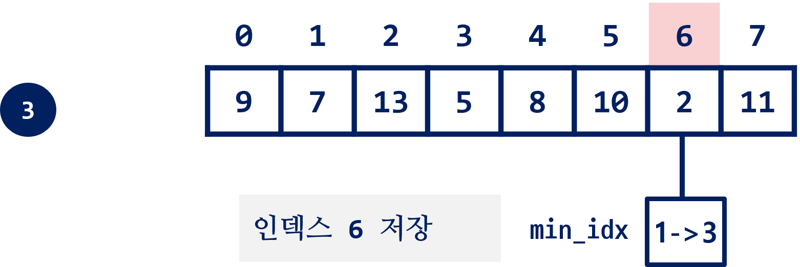

# 최소/최대 구하기

### 최소값 구하기

- `lst` 에서 최소값을 찾는다.

```python
lst = [9, 7, 13, 5, 8, 10, 2, 11]
```


```python
min_val = lst[0]         # lst[0]을 지금까지 발견한 최소값으로 가정
```

- `lst`를 순회한 후 최소값을 저장할 변수(`min_val`)가 필요하다.
- `min_val`의 초기값으로 `lst[0]`을 저장한다.
- 또는, `lst`에 값보다 큰 값으로 설정해도 된다.

--------



- `lst`의 첫번째 **9**를 가져와서 비교하면 `False` 이므로 다음으로

```python
min_val = lst[0]         
for val in lst:
    if min_val > val:
        min_val = val
```

-------

- 다음, **7**이 **9** 보다 작으니 `min_val`에 저장



-------

- 다음, **13 SKIP**



-------

- 다음, **5** 가 더 작은 값이므로 저장



-------

- 다음, **8**과 **10** 은 차례로 **SKIP**

- **2**가 **5**보다 작으므로 저장



- `for` 문이 종료하면 `min_val`에는 **최소값 2**가 저장된 상태

### 최소값 위치 찾기

- `min_idx` 변수에 최소값의 위치를 계산해서 저장

- 초기값은 첫번째 값의 인덱스인 **0**을 저장



```python
min_idx = 0
for idx in range(1, len(lst)):      # 1부터 시작하는 인덱스
    if lst[min_idx] > lst[idx]:
        min_idx = idx

print(min_idx, lst[min_idx])
```

- `min_idx`에 인덱스가 저장하므로, `range(1, len(lst))` 로 인덱스를 생성.
- 이때, 0번은 할 필요가 없으므로, 1번 인덱스 부터 생성.

------



--------




> **초기값 설정**
> 
> - 리스트의 첫번째 값을 설정할 수 없는 경우가 있다.
> 
> - 반복해서 계산된 값들 중에 최소/최대 값을 찾는 경우에는 변수 생성시 저장할 값이 아직 없다.
> 
> - 이럴 경우에는, 최소값을 구하는 경우에는 계산값으로 나올 수 있는 최대값과 **같거나 큰값** 을 저장한다. 최대값을 구하는 경우에는 작은값을 저장한다.


------

#### 최소(최대)값이 둘 이상일때

- 문제에서 최소값이 하나가 아니고 여러개 일때, 순서상 가장 먼저 나오는 위치 또는 가장 마지막 위치를 찾아야 하는 경우
  
  ```python
  lst = [9, 7, 2, 5, 8, 2, 10, 2, 11]
  min_idx = 0
  for idx in range(len(lst)):      # lst에 인덱스 사용
      if lst[min_idx] > lst[idx]:  # lst[2]일 경우에만 True
          min_idx = idx
  
  print(min_idx, lst[min_idx])
  ```

- 위 코드에서는 처음 나오는 `lst[2]` 의 경우에만 조건이 `True`

- 아래와 같이 등호(`=`)를 포함해서 비교하게 되면, 마지막에 나오는 최소값의 위치가 `min_idx` 에 저장
  
  ```python
  for idx in range(len(lst)):     
      if lst[min_idx] >= lst[idx]:  # 같은 값인 경우 모두 True
  ```


