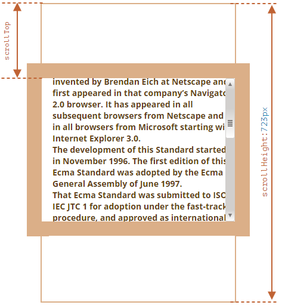

# infinite scroll

### Element: clientHeight

- `clientHeight` = `CSS height` + `CSS padding` - `가로 스크롤 막대 높이(있다면)`
- `clientHeight` 가 루트 요소(`<html>` 또는 `<body>`)에서 사용되면 `viewport`의 높이 반환

::: tip

:::

### Element: scrollTop

- `scrollTop`은 요소(element)의 상단(`top`)에서 보이는 영역(visible content) 까지의 거리 값
- 요소가 스크롤 될 수 없다면 `scrollTop` 은 `0` 이다.

::: tip

:::

### Element: scrollHeight

::: tip

:::


```js
document.addEventListener('scroll', (event) => {
     
    const {scrollTop, scrollHeight, clientHeight} = document.documentElement
    
    // if(scrollHeight - scrollTop === clientHeight){
    if (Math.abs(element.scrollHeight - element.clientHeight - element.scrollTop) < 1){
      
    }
  }
)
```

## TMDB Example

```html
<h1>Popular Movies</h1>
  <hr>
  <div class="movie-list">
    <div class="movie-card">
      <p class="movie-title">영화 제목</p>      
    </div>
  </div>
```

```css
body {
  height: 1000px;
}
.movie-card {
  height: 5rem;
  background-color: aquamarine;
  border-radius: 20px;
  margin-top: 0.5rem;
  padding-left: 2rem;
}
.movie-title {
  font-size: 1.5rem;
  font-weight: bold;
}
p{
  margin: 0;
  overflow: hidden;
}

```


```js
const movieList = document.querySelector('.movie-list')
let pageNo = 1
document.addEventListener('scroll', event => {

  const {clientHeight, scrollHeight, scrollTop} = document.documentElement
  console.log(scrollHeight, scrollTop, clientHeight, scrollHeight - scrollTop)
  if(scrollHeight - scrollTop === clientHeight) {    
    axios({      
      url: 'https://api.themoviedb.org/3/movie/popular',
      params: {
        api_key: 'api_key',
        language: 'ko-KR',
        page: pageNo,
      },
    })
      .then(res => {
        totalPage = res.data.totalPages
        const movies = res.data.results
        for(let movie of movies){
          movieList.appendChild(createMovieCard(movie))
        }
        pageNo += 1
      })
  }
})

function createMovieCard(movie){
  const card = document.createElement('div')
  card.setAttribute('class', 'movie-card')
  const title = document.createElement('p')
  title.classList.add('movie-title')
  title.innerText = movie.title
  card.appendChild(title)
  return card
}
```
---------------
## Inetersection Observer

```js
const movieList = document.querySelector('.movie-list')
let pageNo = 1

function createMovieCard(movie){
  const card = document.createElement('div')
  card.setAttribute('class', 'movie-card')
  const title = document.createElement('p')
  title.classList.add('movie-title')
  title.innerText = movie.title
  card.appendChild(title)
  return card
}
// 
function callback(entries) {
  entries.forEach(entry => {
    if(entry.isIntersecting) {
      console.log('################')
      fetchMovie()
    }
  });
}
const observer = new IntersectionObserver(callback)
const setntinel = document.querySelector('#sentinel')
observer.observe(setntinel)
```